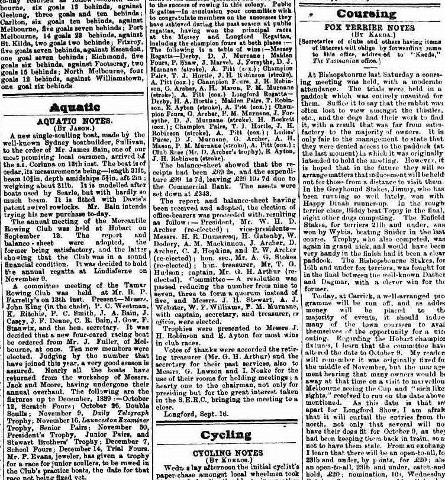
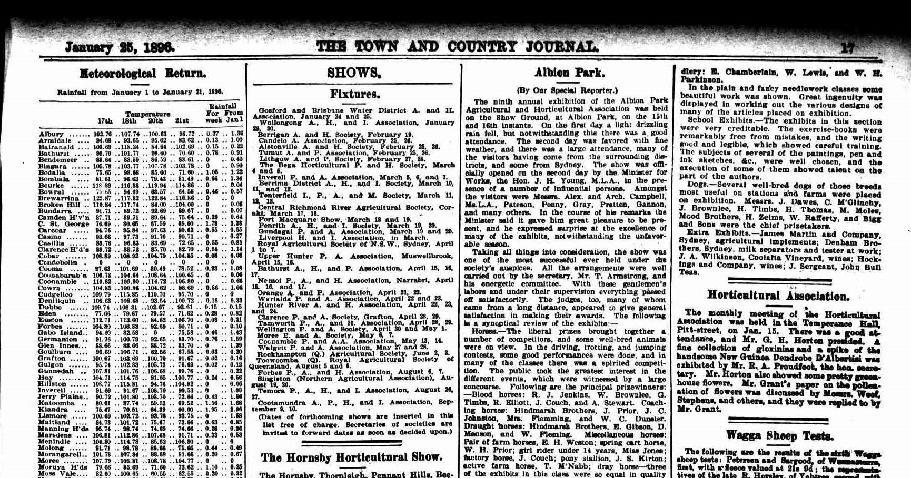

<h4 style="text-align:center;font-style:italic;margin-top:-20px;margin-bottom:50px;"><a href="../../maps/attribution">View Metadata Map</a></h4>
## Language Variants

Zuschreibung; Auteur; Lisänimi; Atribución.

## Usage Notes

The term **by-line** did not come into use until the twentieth century,
though writers’ names could be included in the **headnote**, and the
term is occasionally anachronistically applied. Debate about anonymous
contributions versus signed articles was rife throughout the nineteenth
century: journals such as *The Athenaeum* and The Saturday Review
implemented anonymity as policy until the 1890s, seeing it as “conducive
to the public interest” \[Tener, 63\]. Similar debates were happening
elsewhere; for example, when the national daily newspape*r El Universal*
was established in Mexico in 1888, signatures were removed in favour of
having the newspaper present itself as a unified institution. This might
explain why so few of the collections include author information.
Journalism was only recognised as a profession in the mid-nineteenth
century, and with recognition came subdivisions such as **reporter** and
**columnist**. Occasional contributors, generally known as “special
correspondents” in the Anglophone press, also played an important role.

## Examples:

### Writers’ names within the newspaper layout  

> Example of printed names in *The Tasmanian*, 21 September 1889: 7. Each department has one dedicated pen-name (Jason for Aquatic Notes, Kuklos for Cycling Notes, and Kaeda for Fox Terrier Notes) under which all news items are published. [Trove](http://nla.gov.au/nla.news-page22090149).   
  
“The **headnote** introduces the name pointedly though neatly, and
    no one else among the *Morning Post*’s contributors of verse at this
    period seems to have used it, in relation to ‘Sappho’ or otherwise,
    although pen names of the same kind were much in evidence.”
    \[Landon, 395-96\]

“Under her usual **byline**, Greville‘s article for *The Graphic*
    describing this event competed with more substantial articles in
    London’s *Morning Post*, *Times*, and *Daily News*; her article
    nonetheless reveals her importance as a writer, at least in terms of
    what she called fashionable Society (*Gentlewoman* 108).” \[Cogdill,
    184-85\]

“In the 20th century **contributors, such as authors/journalists,
    photographers, illustrators or cartoonists**, are explicitly marked in
    the article whereas historical newspapers do very rarely mention the
    actual writer.” \[Europeana Newspapers, 21\]

### Writer as regular contributor

“It is true that newspaper **writers** were compelled to devote their
    time, energy, and interest to the loud and ephemeral demands of the
    city room; and while, at first glance, this atmosphere may seem
    stifling, it was actually a richly rewarding and fertile one for the
    men who were to lead the revolt against the ideals of the genteel
    tradition.” \[Kwiat, 99\]

“These sentiments, espoused by the regular *Daily Mail* **columnist**,
    known only as Lady Charlotte in 1896 as part of her ‘Woman’s
    Realm’ feature, epitomize the flagrant contradictions afforded to
    professional women towards the close of the nineteenth century.”
    \[Hunt, 130\]

“He was an owner, editor, and **featured contributor** of the
    *Buffalo Express*.” \[Branch, 584\]

### Journalist as profession

“The word ‘**journalist**’ retained negative connotations from the
    previous century as a partisan hack employed by a patron or
    political party.” \[DNCJ, MR, 326\]

“For Stead, however, often considered the father of investigative
    journalism, this must have been truly what a **journalist** was
    supposed to do: he not only investigated the injustice he wanted to
    uncover, he also became involved.” \[Demoor 2013, para. 13\] 

“Slender of means but sanguine of temperament, Wilfrid worked as a
    **journalist** and editor, and the couple began a hectic period of
    production, both literary and familial.” \[Gray, 148\]

“The **reporter** should be seen as a subset within the developing
    profession of journalism, and a result of the division of labour
    within this new occupation.” \[DNCJ, MaT, 536\] 

“The nineteenth-century **reporter** Emily Crawford had a formidable
    journalistic reputation.” \[Pusapati, para. 1\] 

“The controversy over the refusal to allow a **reporter** from the
    *Women’s Penny Paper* into the parliamentary press gallery in 1890
    offers a useful illustration of the ways in which women used
    journalism to attempt to access and participate in the political
    sphere in practical and symbolic ways.” \[DiCenzo, para. 3\]

“It was two years and more before Crane was again working for a
    newspaper; and it was several more years before, as a war
    correspondent, he served as a regular staff **reporter**.” \[Kwiat,
    106\]

### Non-professional or occasional writers  

> Example of special reporter in *Australian Town and Country Journal*, 25 January 1896: 17. [Trove](http://nla.gov.au/nla.news-page5329095).  

“One of the most prolific **contributors** was Thomas L. Masson.
    Whilst working as a travelling salesman in New York, Masson
    submitted jokes and humorous essays to *Life*, one of the period’s
    most successful comic periodicals.” \[Nicholson 2012, 280\]

“On a sabbatical year in the United Kingdom from 1965 to 1966, he
    immersed himself in the journalism of the 1860s but was frustrated
    by the difficulties of ascertaining the location of copies, the
    lengths of runs, as well as changes in title, editorial staff,
    **contributors**, and affiliations of these little-known
    publications.” \[Shattock 2017a, 3-4\]

“Although her articles hark back to much earlier ideas of woman’s
    place, there is an unmistakable air of change on the horizon in the
    very possibility that woman can stand equal to man, as Lady
    Charlotte does to some extent in offering her columns, frivolous
    though they may be, alongside those of male **contributors**.”
    \[Hunt, 130\] 

“In the course of time, however, various other poems by Wordsworth
    have been found in the *Morning Post* during the period when
    Coleridge was a recognized **contributor**, from late 1797 to 1802.”
    \[Landon, 392\]

“Deze was dus de **auteur** van het artikel over de Unie van
    Vrouwelijke Vrijwilligers”
