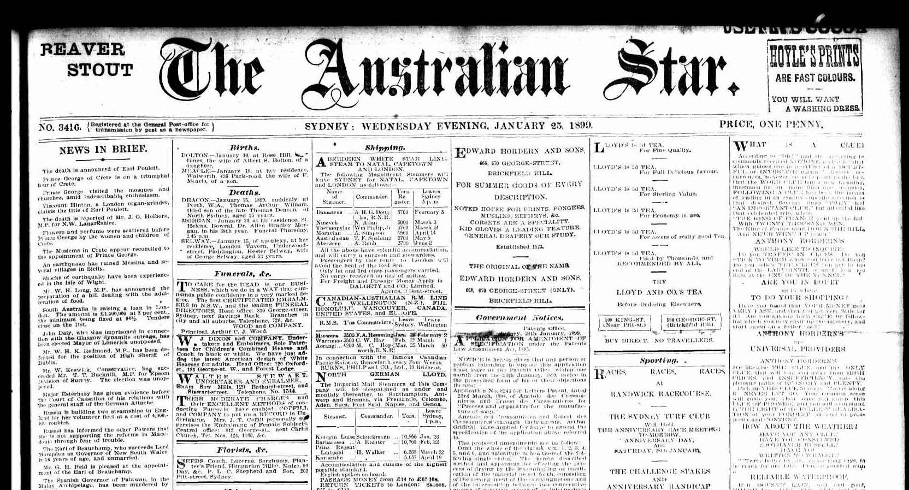

<h4 style="text-align:center;font-style:italic;margin-top:-20px;margin-bottom:50px;"><a href="../../maps/section-heading">View Metadata Map</a></h4>

## Language Variants

Abschnittsüberschrift; Sectietitel; Osaston otsikko; Sección de título. 

## Usage Notes

Section is used in modern journalism to refer to different departments
of the newspaper, such as travel or sport. The nineteenth-century
newspaper similarly had sections for elements such as **letters to the
editor**, **advertisements** and **reviews**, with the term most
commonly used for news from a specific location. The term section was
also used to refer to specific areas of the page layout that had been
broken up by an image as well as the division of one article into
separate pieces that could be published in different issues. Section
headings would be printed in the **folio line** and, in modern
journalism, often have their own mastheads. With the exception of Trove,
differentiated sections are generally zoned algorithmically and assigned
a standardised <a href="https://www.digitisednewspapers.net/glossary/article-category/">**article** **category**</a> rather than the section heading
as printed in that instance.

## Examples:

### Referring to a divided article

“Scott also sent his first ‘vision’ to Croker for publication in the
    *Guardian*, where it duly appeared–arbitrarily cut into two
    **sections**–on 19 December 1819 and 9 January.” \[Garside, 508\]

### Referring to discrete departments of the newspaper

> Example of section headings, including News in Brief, Births, Deaths, Funerals, Shipping, Government Notices and Sporting, in *The Australian Star*, 25 January 1899: 1. [Trove](http://nla.gov.au/nla.news-page24827567).  
  
“For single-**section** newspapers, the pages or parts of pages only
    require a modest labelling in scale with the layout, a panel or
    reverse block, and preferably in the same place on every page.”
    \[Evans, 52\]

“The **sectionalisation** of British newspapers is best exemplified
    by the juggernaut that is *The Sunday Times*.” \[Reeves and Keeble,
    23\]

“For unlike its unstamped predecessors, it did include a **section**
    of leaded editorials (generally placed 6B–C) that like most
    newspaper leaders commented directly on current politics.” \[Jacobs,
    624-25\]

“In contrast to newspapers in other countries where opinions are
    expressed throughout the paper, in the United States, opinion is
    relegated to the editorial or ‘op-ed’ **section** of the newspaper.”
    \[Encyclopedia of Journalism, Kimberley Meltzer, 3.1033\]

“By 1830 its four pages were more structured into **departments than
    in 1800 \[…\]. Departments included Foreign Intelligence, Ship News,
    Domestic Intelligence, Edinburgh News, Births etc., Police Court,
    Aberdeen Shipping,** Correspondence, Miscellaneous Articles,
    Postscripts and Markets.” \[DNCJ, WHF, 1\]

“If we look at historical newspapers we can easily see that their
    main principle of structuring the content was to indicate from where
    the news were coming from and therefore to list the news according
    to their place of origin.” \[Europeana Newspapers 2015, 15\]

“Nineteenth-century publishers were more open about the conventions
    of publishing, reminding contributors of press times in their
    ‘Notices to Correspondents’ **sections**…” \[Hobbs 2018, 113\]

“The Manchester Guardian devoted large **sections** to ‘commercial
    intelligence’, detailed information on stocks and shares, commercial
    markets (e.g. Bank of England figures), shipping news, and market
    prices (both local, such as the Liverpool corn market, and more
    distant such as Birmingham cattle markets and the London Produce
    Market).” \[Cronin, 580\]

