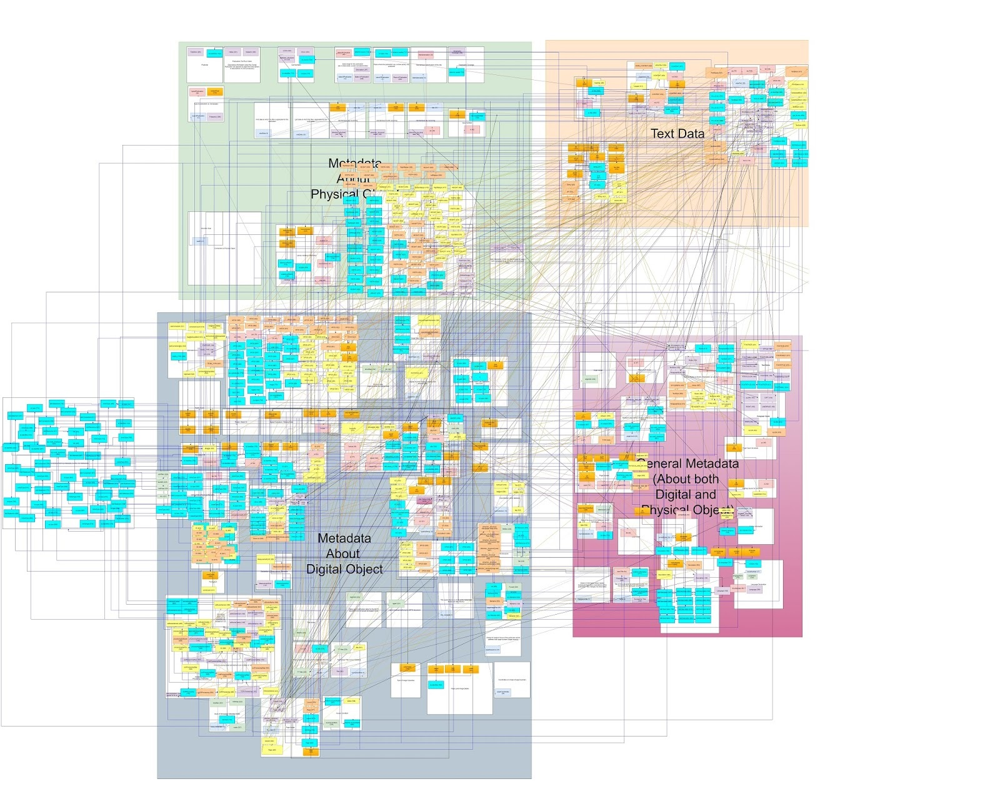

The *Oceanic Exchanges* project aimed to bring together experienced
researchers and rich data sources from around the world in order to
better understand nineteenth-century patterns of news dissemination.
Each of the partner institutions hosted researchers who had previously
worked with at least one of the collections and these scholars worked
with data providers to obtain and, where needed, licence static versions
of these databases for computational research across the project. The
collections were hosted on a secure server by Northeastern University,
which could be consulted remotely by project partners around the world,
and samples from each of these collections were examined by the team at
Loughborough University to catalogue their contents, working with the
providing libraries and project members to ensure this sample reflected
the wider database from which it was derived.

Our first step was to create a master elements list, which provided a
single entry for every possible XPath or JSON path in every collection.
This included information about type of data stored, the technical
definition given in the documentation, if there was one, as well as
interpretive definitions, based on the research experience of project
members or close examination of multiple examples within the database.
The aim was to create a multi-rooted hierarchy, one that showed the
position of every type of data within a given collection, by file and
hierarchical placement within that file, as well as to assign to each a
category, grouping metadata fields across collections. This work was not
straightforward; many collections used similar schema (Dublin Core,
METS, ALTO) but obtained and populated their data fields in different
and often undocumented ways. Simple concepts like “title”, “publisher”
and “article” became very complicated, very quickly—for example, was it
a standardised title conceived by the original cataloguer, or the title
as it appeared on this specific physical object, or a variant title from
a particular edition? Was the information labelled “article” the media
type or the editorial genre?

In the end, working with these collections required a creative and
flexible interpretation of these terms and a clear understanding of the
history and character of specific digital files to inform these
interpretations. We began by retro-engineering the implementation of
these metadata standards, starting with document type definitions (DTDs)
and schema specifications and then complementing these with
documentation on the cataloguing standards used. Although official
documentation was often publicly available, or directly packaged with
the data, we also consulted grey literature such as promotional
materials or online discussions by end users on the nature of the data
available. Other queries were approached through experimentation—testing
hypotheses on the meaning of certain fields through an examination of a
large sample of records, particularly the METS/ALTO variants in multiple
countries.

To clarify apparent inconsistencies within the data and with our
conceptions of these terms, the project team further explored the
specific histories of cataloguing, microfilming and digitising
historical newspapers in these nations. By building upon previous
research by the *Oceanic Exchanges* team, we were able to develop a
robust longitudinal understanding of how the data has been augmented or
repackaged by different institutions in response to technical
innovations and user feedback over the past twenty years. Finally,
researchers from Loughborough University, University College London, the
University of Edinburgh and la Universidad Nacional Autónoma de México
conducted interviews and engaged in correspondence with digitisation
providers and libraries in Mexico, the United States, the United
Kingdom, the Netherlands, Germany, Finland, Australia and New Zealand.
The earnest engagement of these providers allowed us to better
understand the histories of these collections, their selection and
processing of historical newspapers, and their development or adaption
of metadata for describing them.

As we finalised our master list of data and metadata fields, we
attempted to visually group, or map, all possible elements across all
collections, using the visualisation tool draw.io; we anticipated that
the majority of fields would correspond directly to similar fields in
other databases and thus a visual representation would be the clearest
means of conveying the information overlap between collections. However,
attempts to create a single map of all possible elements and attributes,
to provide provenance of internal structures while grouping object by
type and subtype, raised ontological issues not only in developing
hierarchies and links between the fields of the various databases but in
understanding the vocabulary employed to describe elements and
characteristics of the physical newspaper as well.

> Fig. 1. Map of all metadata fields from our samples (each one represented by a different 
> colour), with connecting lines showing the internal hierarchy of each, broken down 
> by metadata of physical object, digital object, metadata pertaining to both, and 
> text data. Unmapped blue boxes refer to user-generated fields exclusive to Trove.

As a result, we decided instead to create this textual ontology of the
metadata fields based upon the structure of the newspaper as a physical
object—a format that we hope will provide a deeper, more nuanced
understanding of this ubiquitous and ambiguous medium. In the spirit of
Ptolemy, this *Atlas* represents our attempt to provide future
researchers with an initial field guide to exploring this heretofore
unmappable terrain.
